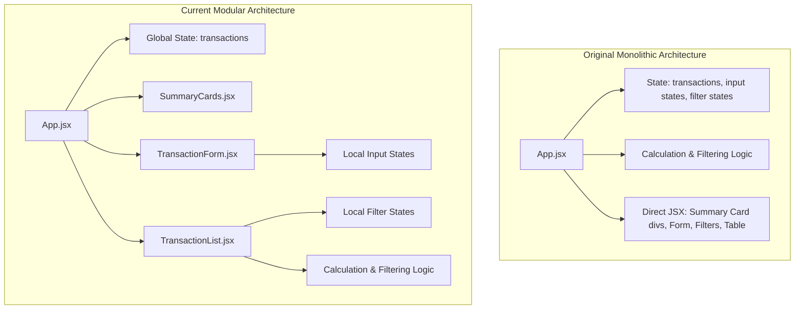

# Agents

This file tracks the details of agent collaborations and tasks in this workspace.

## Active Agents

| Agent Name | Role | Core Responsibility |
| :--- | :--- | :--- |
| **Antigravity** | Parent Agent / Lead Engineer | Handles codebase inspection, bug fixing, architecture refactoring, and UI/UX design. |

## Task Registry

### 1. Application Initialization ⚡
- **Description**: Install dependencies and launch the local Vite development server.
- **Assigned To**: Antigravity
- **Status**: `Completed`
- **Output**: Development server running at [http://localhost:5173/](http://localhost:5173/).

### 2. Codebase Inspection & Diagnostics 🔍
- **Description**: Inspect the starter React code for bugs, logic errors, and poor styling.
- **Assigned To**: Antigravity
- **Status**: `Completed`
- **Artifact**: [analysis_results.md](file:///home/ays19/.gemini/antigravity-cli/brain/4abc5fc4-090f-48ac-90f6-d9d3917745e8/analysis_results.md)

### 3. Financial Calculation Bug Fixes 🐛
- **Description**: Fixed string concatenation in totals, correct "Freelance Work" type classification, correct balance math, and ensured proper floating-point parsing for dynamic transaction submissions.
- **Assigned To**: Antigravity
- **Status**: `Completed`

### 4. Premium Dashboard Refactor & Overhaul (Proposed) 🎨
- **Description**: Partition logic into reusable components, implement delete transactions, and deliver a premium dark/light mode responsive dashboard.
- **Assigned To**: Antigravity
- **Status**: `In Progress`
- **Sub-tasks**:
  - [x] Extract `SummaryCards` component
  - [x] Extract `TransactionForm` component
  - [x] Extract `TransactionTable` component (as part of `TransactionList`)
  - [x] Extract `Filters` component (as part of `TransactionList`)
  - [x] Implement transaction deletion capability
  - [ ] Deliver premium dark/light mode responsive dashboard

## System Architecture & Technical Design

This section outlines the application's layout, component architecture, data flow, and the architectural changes introduced during the modular refactoring phase.

### Original vs. Current Architecture

### Architectural Highlights

1. **State Ownership & Co-location**:
   - **Global State**: The central `transactions` array state is maintained at the parent level (`App.jsx`) to serve as the single source of truth.
   - **Local State Co-location**: Form input states (`description`, `amount`, `type`, `category`) are encapsulated entirely inside `TransactionForm.jsx`. Filter states (`filterType`, `filterCategory`) are encapsulated inside `TransactionList.jsx`. This eliminates unnecessary parent re-renders when a user types in a form or adjusts a filter.

2. **Component Encapsulation**:
   - **SummaryCards.jsx**: Takes the raw `transactions` array and computes `totalIncome`, `totalExpenses`, and `balance` internally. This makes the parent component clean and delegates financial calculation responsibilities to the component concerned with summarizing them.
   - **TransactionForm.jsx**: Accepts an `onAddTransaction` callback prop. When the form is submitted, it validates inputs, calls the parent's callback with the payload, and resets its local form states.
   - **TransactionList.jsx**: Takes the raw `transactions` array and an optional `onDeleteTransaction` callback. It handles filter option rendering, filter logic, and renders the responsive data table with an action column containing a "Delete" button.

3. **Data Flow**:
   - **Unary Downward Data Flow**: Transactions are passed down as props from `App.jsx` to `SummaryCards` and `TransactionList`.
   - **Inverted Control via Callbacks (Upward Data Flow)**: User actions like adding a transaction or deleting one invoke callback functions (`onAddTransaction`, `onDeleteTransaction`) to update the global `transactions` state in `App.jsx`.

### Summary of Architectural Changes

| File | Change Type | Purpose / Architectural Description |
| :--- | :--- | :--- |
| [SummaryCards.jsx](file:///media/ays19/Learning1/Claude%20Code%20for%20Professional%20Developers/code/expense-tracker-starter-main/src/components/SummaryCards.jsx) | **NEW** | Houses all dashboard math (income, expense, balance calculation) and responsive summary card styling. |
| [TransactionForm.jsx](file:///media/ays19/Learning1/Claude%20Code%20for%20Professional%20Developers/code/expense-tracker-starter-main/src/components/TransactionForm.jsx) | **NEW** | Handles form presentation, input state validation, and submit handling. |
| [TransactionList.jsx](file:///media/ays19/Learning1/Claude%20Code%20for%20Professional%20Developers/code/expense-tracker-starter-main/src/components/TransactionList.jsx) | **NEW** | Performs internal list filtering (by category/type) and displays the transactions table with dynamic deletion triggers. |
| [App.jsx](file:///media/ays19/Learning1/Claude%20Code%20for%20Professional%20Developers/code/expense-tracker-starter-main/src/App.jsx) | **MODIFIED** | Shifted from monolithic execution engine to a clean shell coordinator managing the global transactions state. |

